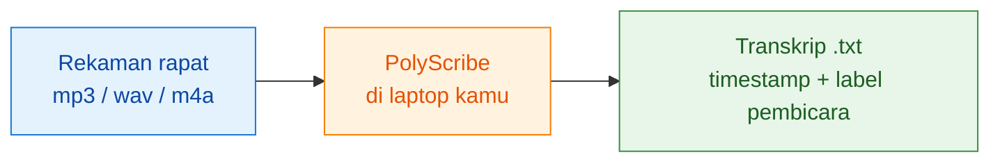
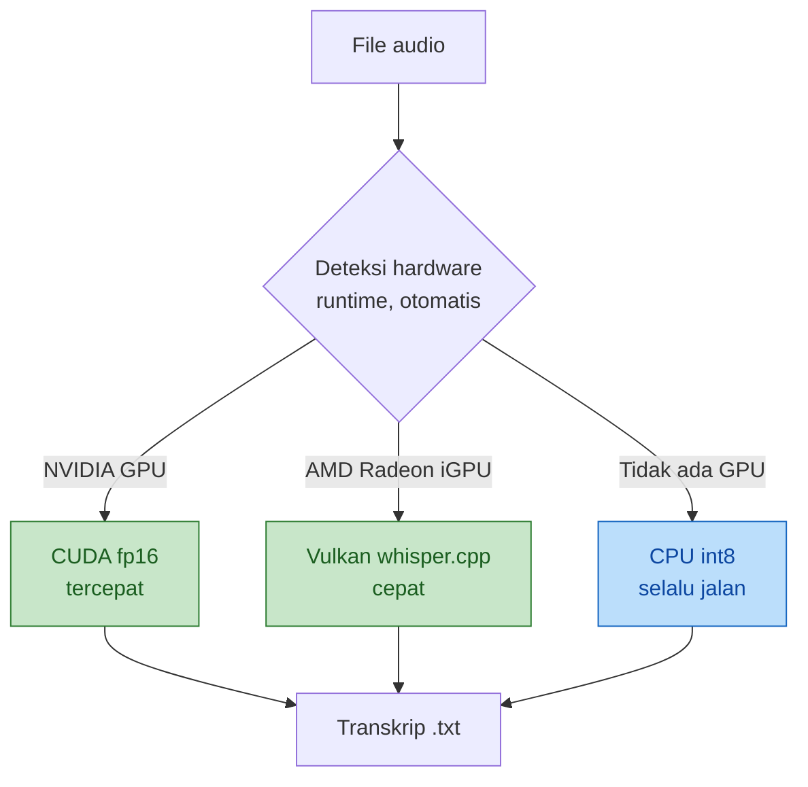
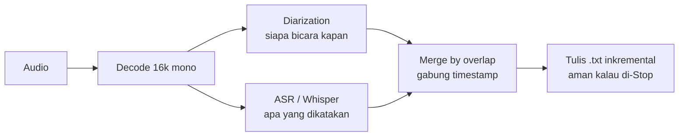

# PolyScribe

> **Transkripsi rapat offline yang cepat, multi-bahasa, dan menjaga privasi kamu.**
> Ubah rekaman audio jadi transkrip berlabel pembicara — tanpa kirim satu byte pun ke cloud.

[](LICENSE)
[](https://www.python.org/downloads/release/python-3110/)
[](https://www.microsoft.com/windows)
[](#privasi-adalah-fitur)
[](#kelebihan-utama)



---

## Yang selama ini bikin frustrasi

Kamu punya rekaman rapat 1 jam. Isinya penting: keputusan, tindak lanjut,
komitmen tim. Tapi:

- **Kirim ke Otter/Rev/Zoom transcription?** Bagaimana kalau isinya M&A,
  strategi kompetitif, atau HR sensitif? Data rapat keluar dari kendali kamu.
- **Ketik ulang manual?** 1 jam audio = 3-4 jam kerja. Setiap minggu.
- **Whisper open-source?** Bagus, tapi cuma menghasilkan **teks tanpa label
  pembicara**. Kamu masih perlu tebak sendiri siapa bicara kapan.
- **Rapat bahasa campur** (Indonesia + English + Arab)? Kebanyakan layanan
  cuma dioptimasi satu bahasa.

**PolyScribe menjawab semuanya.** Offline, multi-bahasa, auto-detect
pembicara, jalan di laptop biasa.

---

## Kelebihan utama

### 🔒 Privasi adalah fitur

- **Nol panggilan jaringan** saat pemrosesan. Audio & transkrip tidak pernah
  keluar dari laptop kamu.
- **Tidak ada akun**, tidak ada token, tidak ada login. Buka aplikasi, drop
  file, dapat transkrip.
- Cocok untuk rapat sensitif: **HR, legal, M&A, strategi, wawancara
  narasumber**.

### 🌏 Multi-bahasa, boleh dicampur

- **Inggris, Arab, Indonesia** — bisa **tercampur dalam satu rekaman**.
- Ideal untuk lingkungan rapat multinasional atau meeting yang berpindah
  bahasa di tengah.

### ⚡ Cepat di hardware yang kamu sudah punya

Angka yang sudah **benar-benar diukur** (rekaman rapat 30 menit, Bahasa
Indonesia campur istilah teknis, 3 pembicara):

| Hardware | Mode | Waktu proses | Rasio |
|----------|------|:-----------:|:-----:|
| **NVIDIA RTX 4060 Laptop (CUDA)** | Akurat (pyannote CUDA) | **4 menit** | **~7.5× realtime** |
| AMD Ryzen AI 7 350 + Radeon 860M | Akurat (pyannote CPU) | ~30 menit | ~1× realtime |

Angka lain (Cepat mode, CPU-only fallback, GPU lain) belum kami ukur formal;
kontribusi benchmark dari pengguna sangat diterima. Detail spec target
performansi di [PRODUCT_SPEC.md §NFR-5](docs/PRODUCT_SPEC.md#52-non-functional-requirements).

### 🎯 Auto-detect jumlah pembicara

**Tidak pernah** minta kamu masukkan jumlah pembicara. Aplikasi mendeteksi
sendiri dari audio — mau 2 orang atau 8 orang, tetap otomatis.

### 🔌 Satu kode, banyak hardware



Push perubahan dari laptop ke laptop — **kode yang sama** memaksimalkan
hardware apa pun yang tersedia. Tanpa fork, tanpa build khusus per mesin.

### 🛟 Tidak pernah crash karena setup tidak lengkap

- Model pyannote belum di-install? → Otomatis fallback ke mode Cepat.
- CUDA rusak? → Otomatis fallback ke CPU.
- Whisper macet mengulang frasa? → Loop guard memotong & memberi peringatan
  jelas di transkrip.
- Proses di-Stop di tengah? → Transkrip parsial tetap tersimpan; tidak hilang.

---

## Contoh output

```
[00:00:03] Pembicara 1: Selamat pagi semuanya, kita mulai standup hari ini.
[00:00:08] Pembicara 2: Oke, dari sisi backend kemarin sudah selesai integrasi
                        payment gateway. Testing round pertama passed all cases.
[00:00:17] Pembicara 1: Great. Any blocker for next sprint?
[00:00:20] Pembicara 3: Yeah, من ناحيتي أحتاج approval untuk pentest scope.
                        Bisa diskusi setelah standup?
[00:00:28] Pembicara 1: Sure, mari kita bahas di 1-on-1.
```

Satu rekaman, tiga bahasa (Indonesia + English + Arab), label pembicara
otomatis, timestamp presisi. Ini output nyata dari pipeline PolyScribe.

---

## Perbandingan singkat

| Aspek | PolyScribe | Layanan transkripsi cloud |
|-------|:---------:|:------------------------:|
| Privasi (data di laptop kamu) | ✅ | ❌ (di server pihak ketiga) |
| Bahasa campur EN + AR + ID | ✅ | ⚠️ Sering satu bahasa dominan |
| Biaya | Gratis (bayar sekali hardware) | Per-menit / bulanan |
| Auto-detect pembicara | ✅ | ✅ |
| Jalan offline (tanpa internet) | ✅ | ❌ |
| Cocok untuk rapat sensitif (HR/legal/M&A) | ✅ | Tergantung SLA + trust |
| Setup pertama | ~10 menit | Sign up + upload |
| Compatible dengan air-gapped environment | ✅ | ❌ |

---

## Cara pakai — 3 perintah

```powershell
# 1. Clone & masuk folder
git clone https://github.com/agunawijaya/PolyScribe.git
cd PolyScribe

# 2. Setup (sekali, ~10 menit termasuk download model 3 GB)
py -3.11 -m venv .venv
& .\.venv\Scripts\python.exe -m pip install --upgrade pip
& .\.venv\Scripts\python.exe -m pip install -r requirements.txt
& .\.venv\Scripts\python.exe scripts\download_models.py

# 3. Transkripsi!
& .\.venv\Scripts\python.exe -m polyscribe.cli "rekaman.mp3"
```

Output `.txt` tertulis di folder yang sama dengan audio input. **Selesai.**

Untuk pengguna non-teknis: klik dua kali **`PolyScribe.bat`** — buka GUI dengan
tombol Start/Stop dan dropdown bahasa.

---

## Instalasi lengkap

### Kebutuhan sistem

- **Windows 10 atau 11** (64-bit)
- **Python 3.11** (via [winget](https://learn.microsoft.com/en-us/windows/package-manager/winget/):
  `winget install --id Python.Python.3.11`) — **bukan** Python dari Microsoft Store.
- **Ruang disk 5-6 GB** untuk model
- **RAM 8 GB minimum**, 16 GB direkomendasikan
- **Opsional untuk lebih cepat:**
  - GPU NVIDIA (RTX seri 20/30/40, GTX 16xx, dsb) untuk mode CUDA
  - Laptop AMD dengan iGPU Radeon (RDNA/RDNA2/RDNA3) untuk mode Vulkan

### Untuk pengguna NVIDIA GPU (opsional, mempercepat 5-10×)

```powershell
& .\.venv\Scripts\python.exe -m pip install -r requirements-cuda.txt
```

Ini menambah torch CUDA + cuBLAS + cuDNN (~4 GB). **URUTAN PENTING**:
`requirements-cuda.txt` harus di-install **sebelum** `requirements-pyannote.txt`
(kalau kamu pakai mode Akurat). Detail di
[TROUBLESHOOTING.md](TROUBLESHOOTING.md#pip-install--r-requirements-pyannotetxt-menghapus-torch-cu126-dan-install-torch-2130-cpu).

### Mode Akurat (pyannote — direkomendasikan untuk kualitas terbaik)

```powershell
& .\.venv\Scripts\python.exe -m pip install -r requirements-pyannote.txt
& .\.venv\Scripts\python.exe scripts\download_models.py --only pyannote --hf-token <TOKEN_HF>
```

Butuh:
1. HF account + token dari <https://huggingface.co/settings/tokens>
2. Klik "Agree and access repository" di
   <https://huggingface.co/pyannote/speaker-diarization-community-1>

**Token hanya dipakai sekali saat download.** Runtime tetap offline
(`HF_HUB_OFFLINE=1`).

Panduan bergambar untuk pengguna baru: [CARA_UNDUH_PYANNOTE.md](CARA_UNDUH_PYANNOTE.md).

---

## Pemakaian lanjutan

### CLI — semua opsi

```powershell
$py = ".\.venv\Scripts\python.exe"

# Default: mode Akurat, bahasa Inggris prioritas
& $py -m polyscribe.cli "rekaman.mp3"

# Mode Cepat (sherpa) — lebih cepat, sedikit kurang presisi
& $py -m polyscribe.cli "rekaman.mp3" --diarizer sherpa

# File multibahasa (deteksi bahasa per segmen)
& $py -m polyscribe.cli "rekaman.mp3" --language auto

# Bahasa spesifik (Indonesia)
& $py -m polyscribe.cli "rekaman.mp3" --language id

# Paksa CPU (matikan GPU)
& $py -m polyscribe.cli "rekaman.mp3" --no-vulkan

# Tuning speaker clustering
& $py -m polyscribe.cli "rekaman.mp3" --cluster-threshold 0.8
```

### GUI (paling ramah non-teknis)

```powershell
& .\.venv\Scripts\python.exe -m polyscribe.gui
```

Atau **klik dua kali `PolyScribe.bat`** — otomatis pindah ke folder repo
(pakai `%~dp0`), jadi bisa diletakkan di Desktop sebagai shortcut.

Fitur GUI:
- Drag-and-drop file audio
- Dropdown bahasa (Inggris / Indonesia / Auto)
- Toggle mode Akurat/Cepat
- Toggle GPU on/off
- **Tombol Stop** — hentikan run dengan rapi, transkrip parsial tersimpan

---

## Cara kerjanya (singkat)



- **Diarization dulu, ASR nanti** — diarization ~6× realtime; setelah label
  siap, ASR di-stream dan tiap segmen langsung ditulis ke disk. Kalau
  proses terhenti di menit ke-50, transkrip parsial tetap ada.
- **Dua backend pluggable** — ASR (`faster-whisper` / `whisper.cpp`) dan
  diarization (`pyannote` / `sherpa`). Ganti backend = ganti satu kelas.
- **Deteksi hardware runtime** — CUDA → Vulkan → CPU, prioritas berjenjang.

Detail teknis di [docs/ARCHITECTURE.md](docs/ARCHITECTURE.md).

---

## Dokumentasi lengkap

| Dokumen | Untuk kamu kalau... |
|---------|---------------------|
| [docs/PRODUCT_SPEC.md](docs/PRODUCT_SPEC.md) | Ingin tahu problem, target user, scope, requirements |
| [docs/ARCHITECTURE.md](docs/ARCHITECTURE.md) | Ingin paham teknis: modul, interface, pipeline, hardware detection |
| [docs/MODELS.md](docs/MODELS.md) | Ingin tahu model apa yang dipakai + lisensi + cara download |
| [TROUBLESHOOTING.md](TROUBLESHOOTING.md) | Kena error atau setup gagal |
| [CONTRIBUTING.md](CONTRIBUTING.md) | Mau berkontribusi (bug fix, backend baru, dsb) |
| [SECURITY.md](SECURITY.md) | Menemukan kerentanan keamanan atau ingin paham model ancaman |
| [CARA_UNDUH_PYANNOTE.md](CARA_UNDUH_PYANNOTE.md) | Setup Mode Akurat dari nol (pengguna baru) |

---

## Ikut membangun

PolyScribe **open-source** dan kami sangat menyambut kontribusi — terutama:

- **Backend hardware baru:** Intel Arc XPU, AMD ROCm (dGPU), Apple MPS.
  Infrastruktur pluggable sudah siap; tinggal implementasi.
- **Peningkatan kualitas** transkripsi bahasa Arab atau bahasa lain.
- **Optimasi performansi** yang terbukti angkanya.
- **Perbaikan bug**, terutama yang datang dengan test case.

Baca [CONTRIBUTING.md](CONTRIBUTING.md) sebelum submit PR. Ada
[template bug report](.github/ISSUE_TEMPLATE/bug_report.md) dan
[template feature request](.github/ISSUE_TEMPLATE/feature_request.md) untuk
issue.

Untuk pengembang yang tertarik dengan filosofi **"satu kode sumber, banyak
target hardware, tidak ada fork"** — proyek ini adalah studi kasus praktis.

---

## Ruang lingkup versi ini

**v1 (sekarang):** dipakai langsung dari virtual environment. Cukup untuk
individu / tim kecil yang setup sendiri.

**Belum di-scope v1** (bisa kontribusi eksternal):
- Packaging `.exe` / installer klik-satu
- Build profile terpisah per hardware (installer AMD vs NVIDIA)
- Distribusi via Microsoft Store / winget

Detail scope: [docs/PRODUCT_SPEC.md §6](docs/PRODUCT_SPEC.md#6-scope).

---

## Struktur proyek (ringkas)

```
polyscribe/     kode aplikasi (pipeline, ASR, diarization, GUI, CLI)
  asr/          backend ASR (faster-whisper, whisper.cpp Vulkan)
  diarization/  backend diarization (sherpa-onnx, pyannote) — pluggable
models/         model AI (TIDAK di-commit — unduh via scripts/)
vendor/         binary native Vulkan (TIDAK di-commit — siapkan manual)
scripts/        download_models.py, benchmark, tools
tests/          unit test (75 test, ≥ 74 harus lulus)
docs/           ARCHITECTURE, PRODUCT_SPEC, MODELS
```

---

## Kredit model AI

PolyScribe berdiri di atas kerja komunitas open-source yang luar biasa:

- **[OpenAI Whisper](https://github.com/openai/whisper)** — ASR (MIT)
- **[faster-whisper](https://github.com/SYSTRAN/faster-whisper)** — akselerasi
  Whisper dengan CTranslate2 (MIT)
- **[whisper.cpp](https://github.com/ggerganov/whisper.cpp)** — Whisper C++
  dengan Vulkan (MIT)
- **[pyannote.audio](https://github.com/pyannote/pyannote-audio)** —
  diarization (MIT code + Community license model)
- **[sherpa-onnx](https://github.com/k2-fsa/sherpa-onnx)** — diarization
  ringan (Apache 2.0)
- **[PyTorch](https://pytorch.org/)**, **[ONNX Runtime](https://onnxruntime.ai/)**,
  **[imageio-ffmpeg](https://github.com/imageio/imageio-ffmpeg)**, dan banyak
  lagi

Detail lisensi setiap model di [docs/MODELS.md](docs/MODELS.md).

---

## Lisensi

PolyScribe (kode) di bawah [Apache License 2.0](LICENSE). Model AI pihak
ketiga tunduk pada lisensi masing-masing — lihat [docs/MODELS.md](docs/MODELS.md).

---

<div align="center">

**Buat pribadi. Simpan pribadi.**
Karena rekaman rapat kamu bukan urusan siapa pun kecuali kamu.

</div>
