# Architecture — PolyScribe

Dokumen ini menjelaskan arsitektur teknis PolyScribe: bagaimana modul-modul
disusun, bagaimana hardware dideteksi & dipilih saat runtime, bagaimana ASR &
diarization di-plug, dan bagaimana pipeline mengalir dari file audio menjadi
transkrip `.txt`. Untuk "apa itu produk ini" lihat [PRODUCT_SPEC.md](PRODUCT_SPEC.md);
untuk cara pemakaian lihat [README](../README.md); untuk konvensi kerja
antar-agen lihat [CLAUDE.md](../CLAUDE.md).

---

## 1. TL;DR

- **Tiga kelas hardware**, dan aplikasi wajib **jalan** di ketiganya: NVIDIA
  (CUDA, **acuan kualitas**), AMD (Vulkan iGPU / CPU), dan CPU-only. **Kualitas,
  kecepatan, dan tumpukan backend BOLEH berbeda antar kelas** — itu justru yang
  diinginkan (keputusan user 2026-08-11). Satu basis kode tetap dipertahankan
  sebagai praktik (perbedaan dijawab di **runtime** + **build profile**, bukan
  fork), tapi ia **bukan** alasan untuk menolak tumpukan yang hanya jalan di satu
  vendor: backend CUDA-only sah ditambahkan untuk profil NVIDIA selama profil lain
  tetap jalan. Lihat catatan koreksi sejarah di [CLAUDE.md](../CLAUDE.md).
- **Dua titik pluggable**: `AsrBackend` untuk transkripsi, `Diarizer` untuk
  pelabelan pembicara. Interface tunggal, implementasi bisa ditukar tanpa
  membongkar pipeline.
- **Offline-first, cloud opt-in.** Jalur DEFAULT (`asr_backend="auto"`) tak
  menyentuh jaringan — model diunduh sekali saat setup, runtime lokal.
  Sejak 2026-09-21, `asr_backend="cloud"` opsional membuka 7 backend cloud
  (Google Web / Groq / OpenAI / Deepgram / AssemblyAI / Azure / Google Cloud);
  dipilih user secara eksplisit per rekaman, TAK PERNAH otomatis. Diarization
  tetap lokal untuk semua jalur.
- **Prioritas hardware**: CUDA (NVIDIA) → Vulkan (iGPU AMD Radeon) → CPU int8
  (universal fallback yang tak pernah gagal karena hardware).
- **Profil NVIDIA = acuan kualitas.** Beberapa cacat yang dikejar lama di jalur
  AMD (tanda baca runtuh, loop mengunci diri) adalah artefak `whisper.cpp` yang
  mewariskan transkrip sebagai konteks; faster-whisper punya
  `prompt_reset_on_temperature` sehingga kelas bug itu tak berlaku di sana. Jangan
  menyeret kompromi khusus-AMD (mis. `whispercpp_max_context`) ke profil NVIDIA.

---

## 2. Pipeline tingkat tinggi

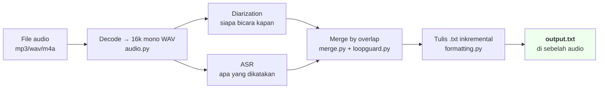

**Kenapa diarization dulu:** diarization ~6× realtime, ASR yang lebih lambat.
Menyelesaikan label speaker duluan memungkinkan ASR di-stream: tiap segmen
transkripsi bisa langsung digabung dengan turn speaker & **ditulis inkremental**
ke `.txt`. Kalau run panjang terputus (mesin sleep, di-kill), transkrip parsial
tetap aman di disk — bukan hilang total karena baru ditulis di akhir.

---

## 3. Modul & tanggung jawab

```
polyscribe/
├── __init__.py           bootstrap Windows CUDA DLL (no-op di non-NVIDIA)
├── cli.py                entry point CLI (argparse, console progress)
├── gui.py                entry point GUI (customtkinter, multi-proses)
├── config.py             Config dataclass — semua knob di satu tempat
├── hardware.py           deteksi Capabilities (CUDA/Vulkan/profile)
├── pipeline.py           orkestrasi: audio → diar → asr(stream) → merge → .txt
├── audio.py              decode ke 16k mono/stereo (via imageio-ffmpeg)
├── merge.py              StreamingMerger: gabung ASR × diarization by overlap
├── formatting.py         IncrementalTxtWriter: tulis .txt aman-interupsi
├── loopguard.py          deteksi & pangkas loop halusinasi Whisper
├── progress.py           kontrak ProgressEvent/ProgressSink
├── spatial.py            fitur ITD/ILD dari stereo (opsional, brief 25/26)
├── asr/                  backend transkripsi (pluggable)
│   ├── base.py           interface AsrBackend + tipe AsrSegment/Word
│   ├── faster_whisper_backend.py    backend A: faster-whisper (CUDA/CPU)
│   └── whispercpp_backend.py        backend B: whisper.cpp (Vulkan/CPU)
└── diarization/          backend pelabelan pembicara (pluggable)
    ├── base.py           interface Diarizer + tipe SpeakerTurn
    ├── pyannote_backend.py          "Akurat" — overlap-aware, torch/CUDA
    ├── sherpa_onnx_backend.py       "Cepat" — CPU-only, no torch
    └── cleanup.py        post-process: buang turn sub-detik, dsb
```

**Pola:** kode aplikasi tidak mengimpor `pyannote` / `faster_whisper` / `sherpa_onnx`
di top-level modul. Setiap backend menyembunyikan library-nya di balik interface.
Modul yang tidak dipakai (mis. pyannote di mesin AMD tanpa Akurat) tidak
di-import → tidak menghabiskan memori & tidak crash saat paketnya absen.

---

## 4. Interface pluggable

### 4.1 ASR

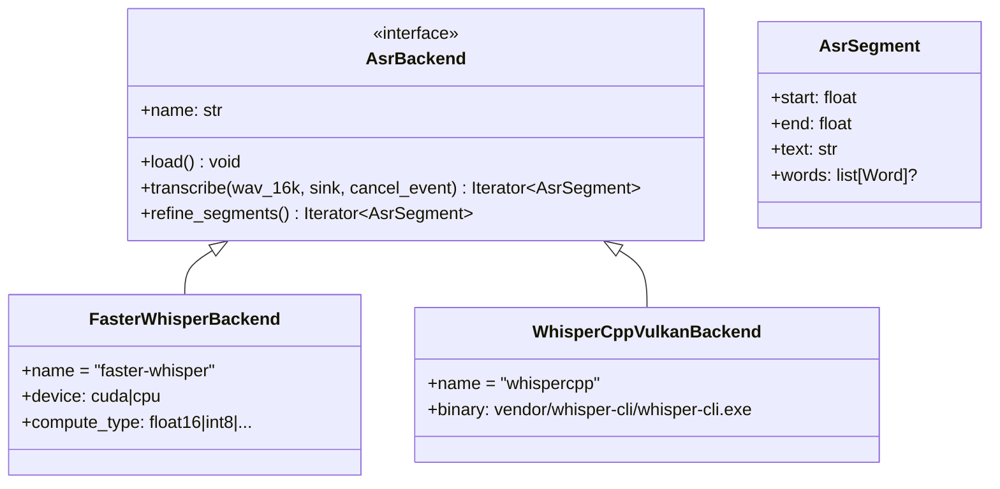

### 4.2 Diarization

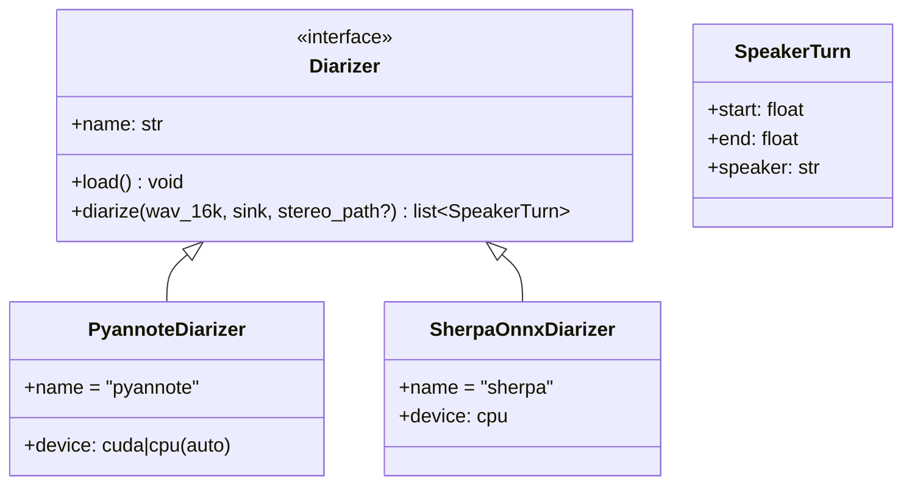

Menambahkan backend baru (mis. mengintegrasi model lokal lain): buat kelas yang
mengimplementasikan interface, daftarkan di `asr/__init__.py` atau
`diarization/__init__.py` — tidak menyentuh `pipeline.py`.

---

## 5. Deteksi hardware runtime

`polyscribe/hardware.py::detect()` mengembalikan `Capabilities` — struct kecil
yang menjadi input untuk selector backend. Dilakukan sekali per invocation,
ringan, dan **tahan-error**: kalau satu cek gagal, fitur itu dianggap tidak
ada — jangan sampai app-nya ikut mati.

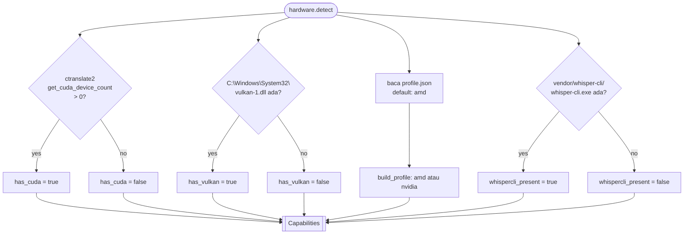

### Pemilihan ASR backend berdasarkan Capabilities

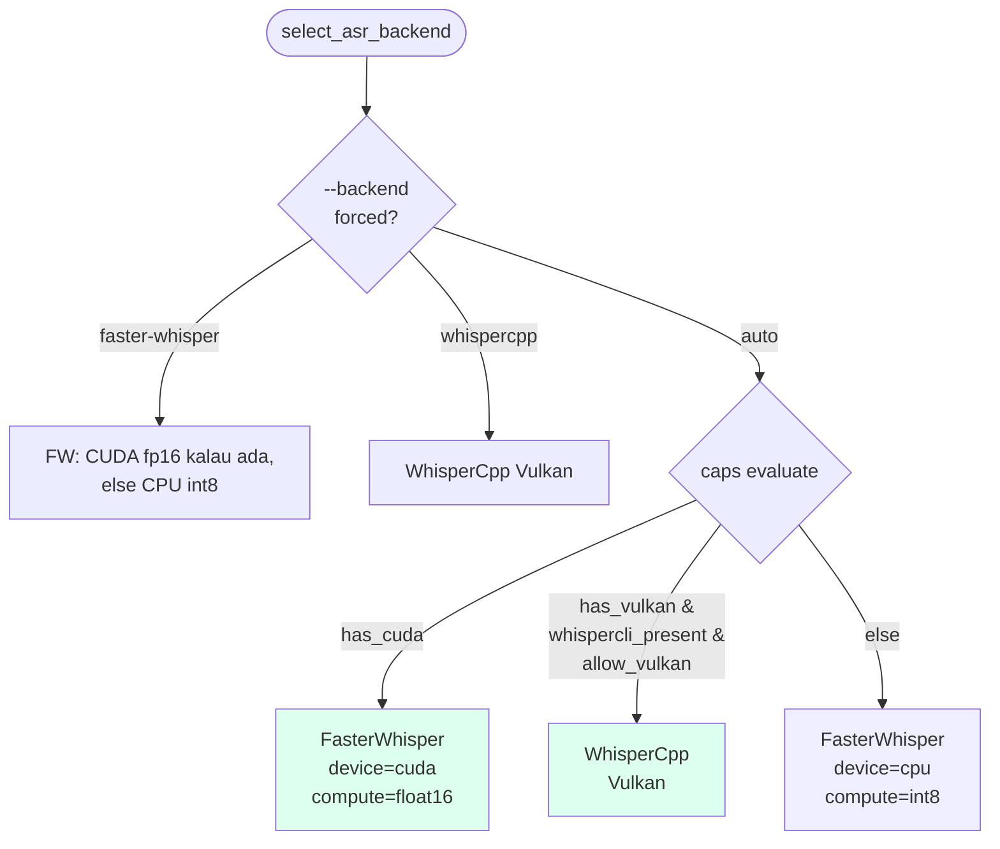

**Catatan penting:** `faster_whisper` sendiri punya `device='auto'`, tapi itu
hanya memilih **cuda-atau-cpu**, tidak pernah Vulkan. Pemilihan Vulkan wajib di
`asr/__init__.py`, bukan diserahkan ke `device='auto'`.

### Pemilihan diarization + fallback

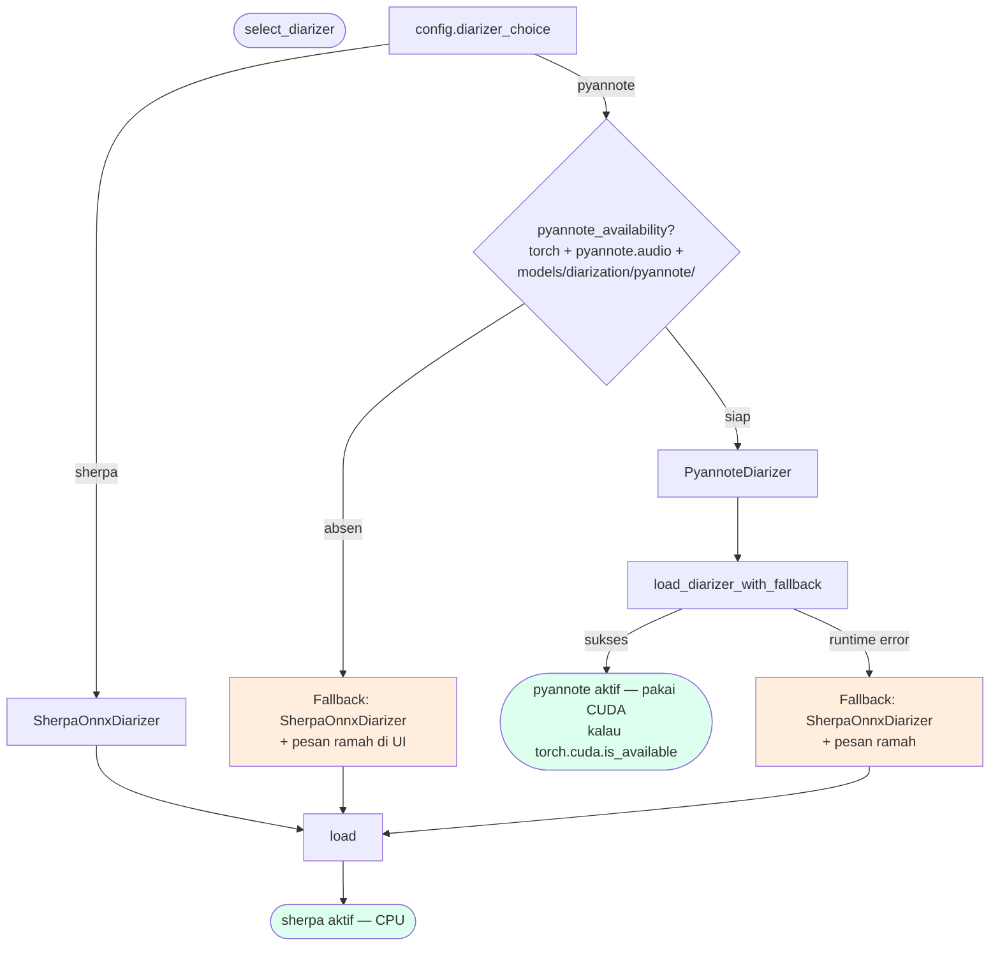

Dua lapis pengaman:
1. `pyannote_availability()` — cek murni struktural (paket + file model) **tanpa**
   memuat torch. Cepat, dipakai UI untuk pesan pre-flight.
2. `load_diarizer_with_fallback()` — tangkap error RUNTIME (mis. k2 stub, DLL
   torchcodec) saat `pipeline.from_pretrained` benar-benar dipanggil. **Aplikasi
   tak boleh mati dengan dialog mentah karena bug pyannote.**

---

## 6. Multi-hardware: satu basis kode, kualitas boleh berbeda

> Diagram di bawah menunjukkan mekanismenya (build profile + deteksi runtime).
> Yang TIDAK ditunjukkan, dan perlu diingat: sejak 2026-08-11 tiap profil boleh
> memakai tumpukan backend yang berbeda — profil NVIDIA boleh menambah backend
> CUDA-only selama profil lain tetap jalan. Lihat NFR-2 di PRODUCT_SPEC.md.

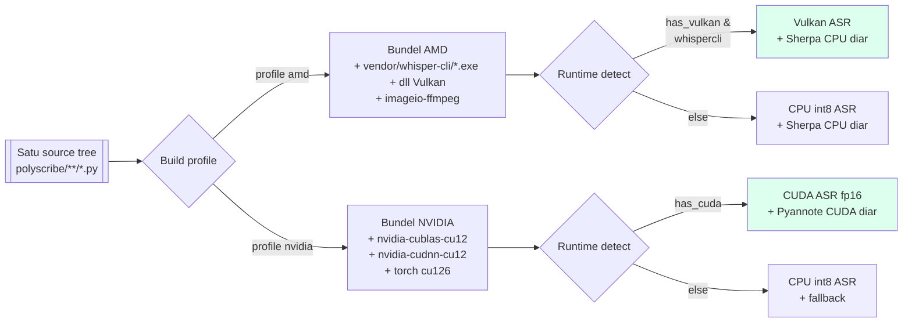

**Beda yang dibundel per profil:**

| Aspek | Profil AMD | Profil NVIDIA |
|-------|------------|---------------|
| Paket pip inti | `requirements.txt` | `requirements.txt` |
| Native binary | `vendor/whisper-cli/*` (Vulkan) | – |
| Paket CUDA | – | `requirements-cuda.txt` (torch cu126, cublas, cudnn) |
| Mode Akurat | opsional (`pyannote` CPU) | opsional (`pyannote` CUDA) |
| Model download | `--only whisper-ggml` juga | tanpa GGML |

**Paket pip di `requirements.txt` IDENTIK di kedua profil.** Yang beda hanya
native lib / model / paket-CUDA yang dibundel di atasnya. Ini yang memastikan
"satu basis kode".

Catatan (2026-08-11): keidentikan ini adalah *keadaan sekarang*, bukan aturan.
Profil NVIDIA boleh menumbuhkan dependency-nya sendiri (mis. tumpukan CUDA-only)
selama profil AMD & CPU-only tetap jalan — pola yang sama seperti
`requirements-cuda.txt` dan `requirements-pyannote.txt` yang sudah terpisah.

### Windows CUDA DLL bootstrap

Detail teknis khusus Windows-NVIDIA (dilaporkan lengkap di
[NVIDIA_01](../prompts/results/NVIDIA_01_fase2a_result.md)):

- Sejak `ctranslate2 4.5`, cuBLAS & cuDNN tidak dibundel; harus dari paket pip
  `nvidia-cublas-cu12` + `nvidia-cudnn-cu12`.
- Paket ini menaruh DLL di `site-packages/nvidia/{cublas,cudnn}/bin/` yang
  **tidak masuk PATH**. `ctranslate2` memuat `cublas64_12.dll` lewat
  `LoadLibraryW` default yang hanya melihat PATH — bukan
  `os.add_dll_directory`.
- **Solusi:** `polyscribe/__init__.py::_bootstrap_windows_cuda_dlls()` men-prepend
  folder-folder itu ke `PATH` saat paket di-import. **No-op di non-Windows dan
  di mesin tanpa paket nvidia-*** — aman ikut satu basis kode.

---

## 7. Sequence: satu transkripsi end-to-end

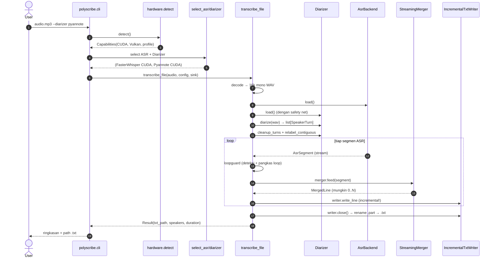

Perhatikan langkah #13-15 (loop): tiap segmen di-flush ke disk begitu final —
bukan buffered sampai akhir. Ini yang membuat `Ctrl+C` di menit ke-50
tetap meninggalkan `.txt.part` yang bisa diselamatkan.

---

## 8. Error handling & jaring pengaman

Tiga lapis pengaman yang berbeda tugas:

1. **`loopguard.LoopDetector`** — deteksi Whisper macet mengulang frasa yang
   sama (halusinasi ASR umum di audio panjang / segmen sunyi). Aksi: pangkas
   pengulangan, sisakan satu instans, tandai `=== PERINGATAN ===` di .txt.
   Tidak diam-diam menghasilkan sampah berjam-jam.

2. **Fallback diarization** — pyannote → sherpa. Lihat §5.
   [diarization/__init__.py::load_diarizer_with_fallback](../polyscribe/diarization/__init__.py).

3. **Atomic .txt commit** — `IncrementalTxtWriter` menulis ke `.txt.part`,
   `os.replace` ke `.txt` hanya saat `close()`. `.txt` lama tidak pernah
   setengah-tertimpa. Kalau proses di-kill di tengah, `.part` tetap ada untuk
   penyelamatan manual.

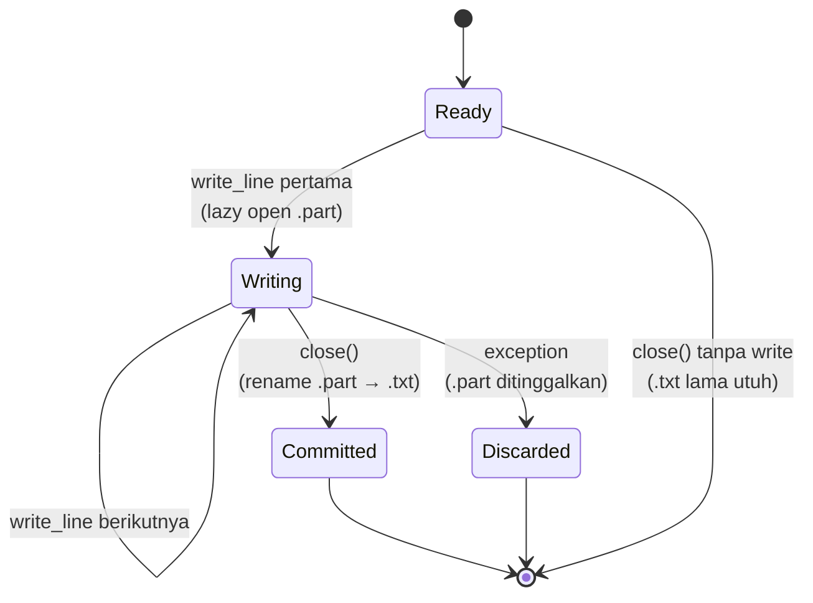

---

## 9. Model management (offline)

- Model **tidak** di git (`.gitignore`: `models/`, `vendor/`).
- Diunduh sekali via `scripts/download_models.py`; sumber: HuggingFace &
  GitHub releases resmi.
- Runtime pakai `local_files_only=True` untuk faster-whisper, `HF_HUB_OFFLINE=1`
  untuk pyannote — **tidak menyentuh jaringan** di jalur default.
- Model pyannote ter-gate di HF: butuh token + lisensi diterima **sekali saat
  setup**; runtime tetap offline tanpa token.

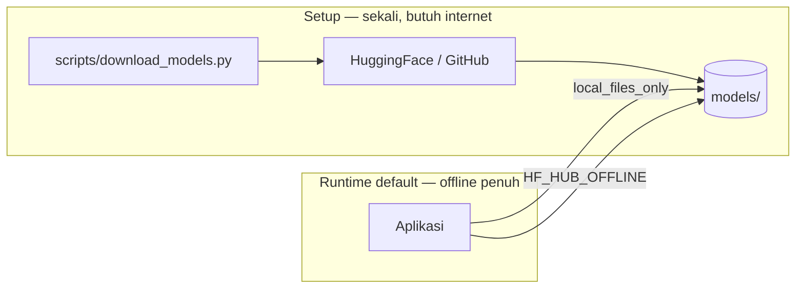

---

## 9b. Cloud backends (opt-in, 2026-09-21)

Modul `polyscribe/asr/cloud/` menyediakan 7 adapter ASR cloud sbg backend
alternatif. Semua mengikuti kontrak `AsrBackend` yg sama dgn backend lokal,
jadi `pipeline.py` tak sadar apakah backend cloud atau lokal.

**Provider terdaftar** (metadata di `registry.py`):
- `google_web` (gratis, endpoint demo tak resmi — sama dgn markitdown Microsoft)
- `groq` (Whisper large-v3, ~$0.04/jam, auto-chunk 5 mnt)
- `openai_whisper` (~$0.36/jam, auto-chunk 5 mnt)
- `deepgram` (Nova-3, ~$0.26/jam, native word-level + diarization)
- `assemblyai` (~$0.37/jam, upload+poll)
- `azure_speech` (~$1.00/jam, butuh region)
- `google_cloud` (chirp_2, ~$0.96/jam, batas KERAS 60 dtk sync — file panjang butuh GCS setup yg belum diimplementasi)

**Alur data**:
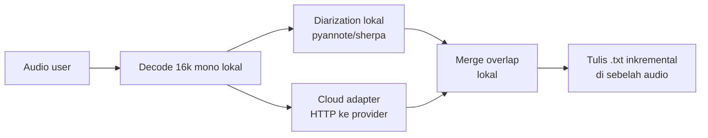

Yang cloud: **hanya lapisan ASR (transkripsi teks)**. Diarization TETAP lokal
untuk semua jalur cloud — provider yg beri speaker labels (Deepgram, AssemblyAI,
Azure, Google Cloud) hasilnya diabaikan supaya output konsisten antar-provider
dan merge.py cuma menerima satu format label.

**Kredensial**: `polyscribe/keystore.py` (Windows Credential Manager via `keyring`).
Write-once di GUI — setelah simpan, key TIDAK PERNAH ditampilkan kembali.

**Validasi ukuran**: `polyscribe/asr/cloud/validation.py` cek durasi + size
audio terhadap batas provider SEBELUM pipeline mulai. Gagal cepat = user tak
menunggu 30 dtk "Memuat model" untuk error yg bisa dideteksi instan.

**Dependency**: `requirements-cloud.txt` (opsional) — `keyring`, `requests`,
`SpeechRecognition` (untuk Google Web), `pydub`. **Sengaja HTTP langsung**,
bukan SDK vendor (install ringan, tak terikat versi SDK).

---

## 10. Concurrency model (GUI)

GUI (`polyscribe.gui`) menjalankan pipeline di **proses terpisah** via
`multiprocessing`, bukan thread. Alasan: diarization sherpa menahan GIL sampai
beberapa menit di file panjang — kalau jalan di thread, UI Tkinter ikut beku
("Not Responding") dan mengundang force-quit.

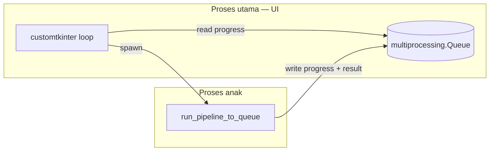

Kontrak antrean: `("progress", ProgressEvent)` selama jalan, lalu tepat satu
`("done", Result)` atau `("error", Exception)`.

---

## 11. Layout file & konvensi

```
PolyScribe/
├── polyscribe/               kode aplikasi (lihat §3)
│   ├── asr/                  backend ASR
│   │   ├── faster_whisper_backend.py   (offline: CUDA / CPU int8)
│   │   ├── whispercpp_backend.py       (offline: Vulkan iGPU AMD)
│   │   └── cloud/                      (opsional: 7 provider)
│   ├── diarization/          backend diarization (pluggable)
│   └── keystore.py           API key vault (Windows Credential Manager)
├── models/                   model AI (offline, no-commit)
├── vendor/                   binary Vulkan whisper-cli (no-commit)
├── scripts/                  download_models, benchmark, tools
├── tests/                    unit test (test_*.py, ~120 test)
├── docs/                     dokumentasi (file ini + PRODUCT_SPEC dst)
├── prompts/                  komunikasi antar-agen (gitignored)
│   ├── results/              output/laporan dari agen
│   └── scripts/              skrip diagnostik per-brief
├── requirements.txt          jalur inti (semua mesin)
├── requirements-cuda.txt     ekstra untuk mesin NVIDIA
├── requirements-pyannote.txt ekstra untuk mode Akurat (pyannote)
├── requirements-cloud.txt    ekstra untuk backend cloud opsional
├── PolyScribe.bat            launcher klik-dua-kali (pakai %~dp0)
├── profile.json              {"profile": "amd" | "nvidia"}
├── README.md                 dokumen user-facing
├── ABOUT.md                  ringkasan produk
├── CLAUDE.md                 konvensi agen-agen (sumber kebenaran)
└── HANDOFF_NVIDIA_PM.md      prompt PM untuk line NVIDIA
```

---

## 12. Non-goals arsitektur

Sengaja **tidak** dilakukan (dan alasan singkat):

- **Server / API mode.** PolyScribe adalah aplikasi desktop; menerima request
  transkripsi dari klien lain di jaringan bukan bagian dari jalur data. Kalau
  butuh, itu produk berbeda.
- **Cloud storage / sync untuk output.** Privasi rekaman rapat = raison
  d'être jalur default. Bila user ingin sinkronkan `.txt`, itu keputusan
  di luar aplikasi (mis. OneDrive folder). (Backend ASR cloud yg ditambahkan
  2026-09-21 mengirim AUDIO ke provider untuk transkripsi — beda dari cloud
  storage/sync yg dimaksud di sini.)
- **Cloud diarization.** Provider cloud yg beri speaker labels native
  diabaikan; pipeline tetap pakai pyannote/sherpa lokal. Alasan: konsistensi
  output antar-provider + merge.py cuma paham satu format label.
- **Cloud sebagai default / fallback otomatis.** Backend cloud memang
  tersedia sbg opsi (2026-09-21) tapi user harus memilih eksplisit. Tak ada
  "hardware lemah? switch ke cloud diam-diam" flow.
- **Multi-tenant / user accounts.** Aplikasi single-user di laptop pribadi.
- **Streaming realtime (live transcription).** Pipeline dirancang untuk file
  audio yang sudah ada, bukan stream mic. Whisper large-v3 juga tidak dioptimasi
  untuk latency rendah.
- **Fork per hardware.** Ditolak eksplisit di CLAUDE.md. Satu basis kode +
  runtime detect + build profile.
- **Google Cloud LongRunningRecognize (BatchRecognize + GCS bucket).**
  Sengaja tak diimplementasi meski file > 60 dtk butuh mode ini. Alasan:
  Deepgram $0.26/jam menang atas GC $0.96/jam di semua aspek + tak butuh
  setup GCS. Untuk user pribadi tanpa kontrak GCP, tak ada return-nya.

---

## 13. Referensi

- [README.md](../README.md) — cara install & pakai
- [PRODUCT_SPEC.md](PRODUCT_SPEC.md) — apa dan siapa
- [CLAUDE.md](../CLAUDE.md) — konvensi & perintah run/test terverifikasi
- [ABOUT.md](../ABOUT.md) — ringkasan produk untuk audiens lebih luas
- [HANDOFF_NVIDIA_PM.md](../HANDOFF_NVIDIA_PM.md) — konteks bootstrap line NVIDIA
