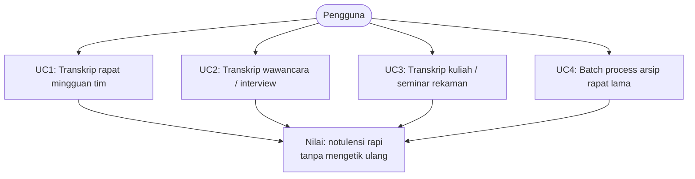
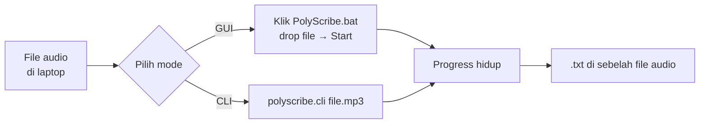

# Product Specification — PolyScribe

Dokumen ini menetapkan **apa** yang PolyScribe kerjakan, **siapa** target
penggunanya, **kenapa** ia ada, dan **apa yang menandai keberhasilannya**.
Untuk **bagaimana** teknisnya, lihat [ARCHITECTURE.md](ARCHITECTURE.md).

Perubahan spec ini harus melalui review PM+Architect — bukan diputuskan di
level Programmer.

---

## 1. Ringkasan eksekutif

**PolyScribe** = aplikasi desktop Windows untuk **transkripsi & diarization**
rekaman rapat, berjalan **sepenuhnya offline**. Mengubah satu file audio
menjadi satu file `.txt` bertimestamp dengan label pembicara, tanpa mengirim
apa pun ke cloud.

**Nilai utama:** privasi (rapat internal tidak keluar dari laptop) + multi-bahasa
(EN/AR/ID, boleh campur) + auto (jumlah pembicara dideteksi otomatis).

---

## 2. Problem statement

Rapat kerja modern menghasilkan rekaman audio yang perlu ditranskrip untuk
notulensi, referensi, atau kepatuhan. Solusi cloud umum (Otter, Zoom
transcription, Rev, dll) tidak memadai untuk:

1. **Rapat sensitif** (M&A, HR, litigasi, strategi) — pengiriman audio ke pihak
   ketiga menciptakan risiko kebocoran & compliance yang tidak dapat diterima.
2. **Audio campur bahasa** (Indonesia + Inggris + Arab dalam satu rekaman) —
   sebagian besar layanan cloud dioptimasi untuk satu bahasa dan menghasilkan
   nonsense pada bagian yang berpindah bahasa.
3. **Lingkungan tanpa internet stabil** (di lapangan, di luar negeri, di
   fasilitas dengan air-gap).

**Alternatif "run Whisper sendiri"** memang bisa, tapi Whisper mentah hanya
menghasilkan transkrip tanpa label pembicara — dan menggabungkan Whisper dengan
diarization tool (pyannote, sherpa) sendiri butuh integrasi yang non-trivial:
merge overlap timing, loop-guard halusinasi, penulisan aman-interupsi,
pemilihan backend per hardware. PolyScribe = kombinasi tersebut yang sudah
disatukan menjadi aplikasi jadi.

---

## 3. Target pengguna & persona

### Primary persona: "Manajer / analis di rapat internal"

- Mengelola rapat 30 menit–2 jam berbahasa campur (mayoritas ID, banyak istilah
  EN, kadang AR untuk konteks regional).
- Butuh transkrip tepat waktu untuk notulensi & tindak lanjut.
- Bukan pemrogram, tapi bisa menjalankan file `.bat` dan mengelola folder.
- Punya laptop kerja Windows dengan spesifikasi menengah-atas.

### Secondary persona: "IT / researcher"

- Menjalankan versi CLI untuk batch processing atau eksperimen.
- Nyaman dengan PowerShell, venv, dan tuning parameter.
- Ingin memastikan tidak ada data yang bocor ke luar mesin.

### Explicit non-persona

- **Broadcaster / captioner realtime** — PolyScribe bukan alat live captioning.
- **Enterprise IT admin** yang butuh deployment massal + user management — di
  luar scope; PolyScribe adalah tool single-user.
- **Peneliti akademis diarization** yang butuh evaluasi metrik formal (DER,
  JER) — tool ini tidak menyediakan evaluator.

---

## 4. Use cases utama

Semua use case punya alur yang **sama**:

---

## 5. Requirements

### 5.1 Functional requirements

**FR-1: Format input.** Menerima file audio umum (MP3, WAV, M4A minimum).
Otomatis di-decode ke internal 16 kHz mono untuk pemrosesan.

**FR-2: Output.** Menulis satu file `.txt` di **folder yang sama dengan file
audio input**, dengan nama `<basename>.txt`. Format tiap baris:
`[HH:MM:SS] Pembicara N: <teks>`.

**FR-3: Diarization otomatis.** Jumlah pembicara **selalu dideteksi otomatis**.
Aplikasi tidak pernah meminta user memasukkan jumlah pembicara secara manual.

**FR-4: Multi-bahasa.** Mendukung EN + AR + ID, boleh campur dalam satu
rekaman. Default: fokus EN dengan segmen non-EN insidental dilayani. Mode
`--language auto` untuk file yang benar-benar multibahasa.

**FR-5: Dua mode diarization pluggable.**
- **Akurat** (`pyannote`, default) — overlap-aware, memisahkan pertukaran
  cepat. ~2.5× lebih lambat.
- **Cepat** (`sherpa`) — CPU-only, ringan. **Fallback otomatis** bila
  model/paket pyannote tidak tersedia — aplikasi **tidak pernah crash** karena
  Akurat tidak tersedia.

**FR-6: Progress hidup.** GUI & CLI keduanya menampilkan progress yang bergerak
(stage + persentase + cuplikan teks) selama pemrosesan.

**FR-7: Interupsi aman.** Tombol Stop di GUI menghentikan proses dengan rapi;
transkrip parsial sampai titik henti tetap tertulis ke disk. Kill mendadak
(mesin sleep, force-quit) meninggalkan `.txt.part` yang bisa diselamatkan
manual.

**FR-8: Loop guard.** Deteksi & tangani halusinasi Whisper berupa
frasa berulang. Ketika terdeteksi: pangkas pengulangan, sisakan satu instans,
tandai dengan `=== PERINGATAN ===` di `.txt`. **Tidak boleh** menghasilkan
sampah berjam-jam secara diam-diam.

**FR-9: Pilihan bahasa GUI.** Dropdown bahasa (Inggris / Bahasa Indonesia /
Auto). Toggle mode Akurat/Cepat. Toggle GPU (opsional matikan Vulkan/CUDA).

### 5.2 Non-functional requirements

**NFR-1: Offline penuh (WAJIB).** Tidak ada panggilan cloud. Tidak ada
login/token di jalur utama runtime. Model diunduh sekali saat setup; setelah
itu tidak ada akses jaringan.

*Rasionalisasi:* privacy = raison d'être; jaminan ini yang membedakan
PolyScribe dari solusi cloud.

**NFR-2: Multi-hardware — wajib JALAN di mana-mana, tidak wajib SERAGAM.**
Aplikasi wajib jalan di tiga kelas mesin: Windows NVIDIA (CUDA, **acuan
kualitas**), Windows AMD Radeon iGPU (Vulkan/CPU), dan CPU-only. Pemilihan
backend lewat **deteksi runtime**, bukan hardcode per-vendor. **Kualitas,
kecepatan, dan tumpukan backend BOLEH berbeda antar kelas**, dan tumpukan yang
hanya jalan di satu vendor (mis. CUDA-only) sah dipakai di profil vendor itu
selama kelas lain tetap jalan.

*Rasionalisasi:* user punya beberapa laptop dan secara eksplisit mengizinkan
solusi berbeda per mesin demi hasil terbaik (2026-08-11). Satu basis kode tetap
dipertahankan untuk mencegah drift, tapi keseragaman KUALITAS bukan tujuan —
memaksakannya justru menurunkan mesin kuat ke batas mesin terlemah.

*Revisi:* NFR ini sebelumnya berbunyi "wajib jalan di dua platform target lewat
satu kode sumber" dan dibaca sebagai larangan memakai tumpukan CUDA-only. Itu
hasil penafsiran agen atas maksud user, bukan permintaan user — lihat catatan
koreksi sejarah di CLAUDE.md.

**NFR-3: Tidak pernah crash karena hardware/model absen.** Kalau CUDA tidak
ada → fallback CPU. Kalau Vulkan tidak ada → fallback CPU. Kalau pyannote tidak
terpasang → fallback sherpa. Kalau model pyannote absen → fallback sherpa.
Kalau runtime pyannote gagal → fallback sherpa. `.txt` tetap dihasilkan.

**NFR-4: Interupsi tidak boleh menghilangkan data.** Ditulis inkremental,
rename atomik. `.txt` lama (dari run sebelumnya) tidak pernah setengah-tertimpa.

**NFR-5: Performansi.** Rasio waktu proses ke audio (semakin kecil semakin baik):

| Konfigurasi | Target | Status verifikasi |
|-------------|--------|-------------------|
| NVIDIA CUDA + Akurat | ≤ 1/5 realtime | ✅ ~1/7.5 diukur di RTX 4060 Laptop |
| NVIDIA CUDA + Cepat | ≤ 1/10 realtime | belum diukur di sini |
| AMD Vulkan + Cepat | ≤ 1× realtime | ✅ per CLAUDE.md |
| AMD Vulkan + Akurat | ≤ 2× realtime | ~1× per CLAUDE.md ("1 jam ≈ 1 jam") |
| CPU-only + Cepat | best effort | – |

Target-target ini bersifat **panduan kualitas**, bukan gerbang keras.
Bottleneck utama = model besar (large-v3) + diarization Akurat.

**NFR-6: Kualitas transkripsi & diarization.** Diukur oleh:
- **DER** (Diarization Error Rate) — tidak dievaluasi otomatis; validasi
  kualitatif oleh Tester manusia yang mendengarkan audio & membaca `.txt`.
- **Jumlah pembicara di file panjang** — tidak boleh meledak (over-split).
  Verifikasi historis: 15 label untuk ~7 orang = over-split; setelah tuning
  turun ke ~7. Rapat berpeserta 8+ belum diuji tuntas.
- **Loop halusinasi** — tidak boleh lolos ke `.txt` tanpa peringatan.

**NFR-7: Kejelasan pesan error.** Setiap kegagalan yang bisa diprediksi user
(model absen, HF token salah, audio corrupt) harus menghasilkan pesan
Bahasa Indonesia yang menuntun ke perbaikan — bukan stack trace mentah.

**NFR-8: Menghormati sumber daya laptop.** Pipeline tidak menahan seluruh
audio di memori jika bisa di-stream. `.txt` di-flush per baris. Diarization di
proses terpisah supaya GUI tetap hidup.

### 5.3 Constraints

- **C-1: OS.** Windows 10/11 saja. Linux/macOS tidak di-support di v1.
- **C-2: Python.** 3.11 (bukan 3.13 Store — bermasalah untuk native lib &
  PyInstaller).
- **C-3: Bahasa native.** Bahasa Indonesia digunakan untuk semua UI text,
  pesan error, komentar kode & dokumentasi internal. Kode Python & interface
  tetap Bahasa Inggris.
- **C-4: Model licenses.** Whisper (MIT), sherpa-onnx (Apache), pyannote
  community-1 (community license, klik-Agree di HF). Tidak ada model
  proprietary yang tidak bisa dibagi.
- **C-5: Ukuran model.** ± 5–6 GB (large-v3 + sherpa + pyannote). Kalau target
  hardware lebih terbatas, mode fallback ke model lebih kecil bukan bagian v1.

---

## 6. Scope

### 6.1 In scope (v1)

- Core CLI (`polyscribe.cli`) dengan semua flag: `--backend`, `--diarizer`,
  `--language`, `--cluster-threshold`, `--no-vulkan`.
- GUI (`polyscribe.gui`) dengan progress hidup, Stop, toggle bahasa & mode.
- Dua ASR backend: `faster-whisper` (CUDA/CPU) + `whisper.cpp` (Vulkan) di
  AMD.
- Dua diarization backend: `pyannote` (Akurat, default) + `sherpa` (Cepat,
  fallback).
- Loop guard, atomic file write, decoding via `imageio-ffmpeg`.
- Runtime detection untuk pemilihan backend.
- Support 3 kelas hardware: Windows NVIDIA (dGPU, acuan kualitas) + Windows AMD
  (Radeon iGPU) + CPU-only. Tumpukan boleh berbeda per kelas (NFR-2).
- Bootstrap Windows CUDA DLL (helper di `polyscribe/__init__.py`).
- Auto-fallback yang aman di setiap titik kegagalan yang bisa diprediksi.

### 6.2 Out of scope (v1 — dibekukan)

- **Packaging `.exe` / installer.** Jalan langsung dari venv sudah cukup.
- **Build profile terpisah per hardware.** Sudah dirancang, belum
  diimplementasikan sebagai installer.
- **Distribusi massal / auto-update.**
- **Manifest model / provisioning otomatis.**
- **API server / REST endpoint.**
- **Live transcription** dari mic.
- **Backend baru** (Intel Arc, ROCm, MPS Apple Silicon) — dibuka untuk
  kontribusi eksternal via GitHub public repo, tapi bukan target internal v1.
- **Speaker naming** ("SPEAKER_00" jadi "Ardhi") — otomatis atau manual, di
  luar scope v1.

### 6.3 Explicit anti-features

Hal-hal yang **sengaja tidak dibuat** meskipun mudah:

- **Input jumlah pembicara manual.** Auto-detect adalah janji produk. Kalau
  auto-detect salah, itu bug diarization yang harus diperbaiki, bukan
  disembunyikan lewat opsi manual.
- **Cloud fallback** (untuk hardware yang tidak sanggup lokal).
- **Telemetri / analytics** (mencatat pemakaian, statistik).

---

## 7. Success criteria & acceptance tests

### 7.1 Setup success

- ✅ `pip install -r requirements.txt` sukses di Python 3.11 Windows.
- ✅ (NVIDIA) `pip install -r requirements-cuda.txt` diikuti (opsional)
  `requirements-pyannote.txt` menghasilkan runtime dengan `torch.cuda.is_available()`
  = True.
- ✅ `python scripts/download_models.py` mengunduh model ke `models/`
  dan runtime bisa menemukannya (`local_files_only=True`).

### 7.2 Runtime success

- ✅ `python -m polyscribe.cli <audio>` menghasilkan `.txt` dengan format yang
  ditentukan di FR-2.
- ✅ Jumlah pembicara di `.txt` masuk akal dibanding audio (dievaluasi
  Tester manusia).
- ✅ Tidak ada crash pada file audio 30–120 menit.
- ✅ Loop halusinasi (jika ada) ditandai di `.txt`, bukan dihasilkan diam-diam.

### 7.3 Fallback success

- ✅ Aplikasi jalan di mesin tanpa `pyannote` terpasang (fallback ke sherpa).
- ✅ Aplikasi jalan di mesin tanpa CUDA (fallback ke Vulkan atau CPU).
- ✅ Interupsi (Stop di GUI, Ctrl+C di CLI) menghasilkan `.txt` parsial yang
  valid.

### 7.4 Cross-platform success

- ✅ Kode yang sama di push ke laptop AMD tidak menyebabkan regresi.
- ✅ Bootstrap Windows CUDA DLL no-op di laptop AMD (tidak menyebabkan efek
  samping karena paket nvidia-* tidak terinstall).

---

## 8. Metrik & telemetri

**Tidak ada telemetri otomatis.** Sesuai NFR-1 (offline penuh) dan
anti-feature (§6.3), aplikasi tidak mengirim / mencatat statistik pemakaian.

Metrik kualitas dikumpulkan **manual** oleh PM/Tester melalui:
- Waktu proses vs durasi audio (dari log CLI/GUI).
- Jumlah speaker di `.txt` vs jumlah aktual di audio (auditif).
- Cek visual `.txt` — apakah pertukaran cepat terpisah, apakah teks masuk akal.
- Ada/tidak tag `=== PERINGATAN ===` (loop terdeteksi).

Log historis kalibrasi tersimpan di `prompts/results/` (di-.gitignore, tidak
dipublikasikan).

---

## 9. Assumptions & dependencies

**Assumptions:**
- Pengguna punya laptop Windows dengan RAM >= 8 GB (16 GB dianjurkan).
- Pengguna bersedia melakukan setup sekali (~10 menit) untuk unduh model.
- Kualitas audio input adalah "recording rapat wajar" — bukan audio industrial
  ekstrem, bukan sinyal <2 kHz bandwidth.

**External dependencies (lisensi):**
- Whisper (OpenAI) — MIT
- faster-whisper (SYSTRAN) — MIT
- whisper.cpp (ggerganov) — MIT
- sherpa-onnx (k2-fsa) — Apache 2.0
- pyannote.audio 4.x — MIT (paket), Community license (model community-1)
- PyTorch — modified BSD
- imageio-ffmpeg — BSD
- Semua lain: standar Python OSS

---

## 10. Known limitations & open questions

Kejujuran di atas rapi (per CLAUDE.md §"Isu terbuka"):

**L-1: pyannote memberi ~5 speaker di file panjang.** Koheren sejauh diuji,
tapi **belum divalidasi di rapat berpeserta 8+**. Rapat besar bisa memberi
hasil yang salah — harus verifikasi.

**L-2: Micro-triple ("Yeah."/"Exactly.") kadang menyatu.** Batas resolusi ASR
(satu segmen Whisper), bukan diarization. Tidak akan diperbaiki tanpa mengganti
model ASR.

**L-3: Mode Akurat lambat di CPU.** ~2.5× lambat di AMD (embedding CPU).
Perbaikan = pindah ke NVIDIA + CUDA (jalur yang sudah divalidasi).

**L-4: Halusinasi Whisper lokal.** Loop guard menangkap yang sistematis; masih
mungkin ada halusinasi tunggal (bukan berulang) yang lolos. Tandai bila
ditemukan.

**L-5: Kualitas Arab belum tervalidasi tuntas.** Encoding sudah diperbaiki
(UTF-8 di seluruh jalur); transkripsi & diarization Arab belum diuji dengan
banyak audio Arab asli.

**L-6: Bahasa selain EN/AR/ID tidak dijamin.** Whisper multi-language secara
teknis, tapi tuning + validasi kami hanya di tiga bahasa target.

---

## 11. Versioning & rilis

- **v1 (saat ini):** dipakai sendiri; jalan dari venv. Ruang lingkup dibekukan
  (lihat §6). Update terbatas pada bug fix + kalibrasi.
- **Vnext (belum dijadwalkan):** packaging `.exe`, build profile per-hardware
  sebagai installer, kemungkinan speaker naming.

Perubahan yang mengubah scope harus dituangkan di dokumen ini + review PM.

---

## 12. Referensi

- [ARCHITECTURE.md](ARCHITECTURE.md) — cara implementasinya
- [README.md](../README.md) — cara pemakaian
- [ABOUT.md](../ABOUT.md) — ringkasan untuk audiens umum
- [CLAUDE.md](../CLAUDE.md) — konvensi kerja + perintah terverifikasi
